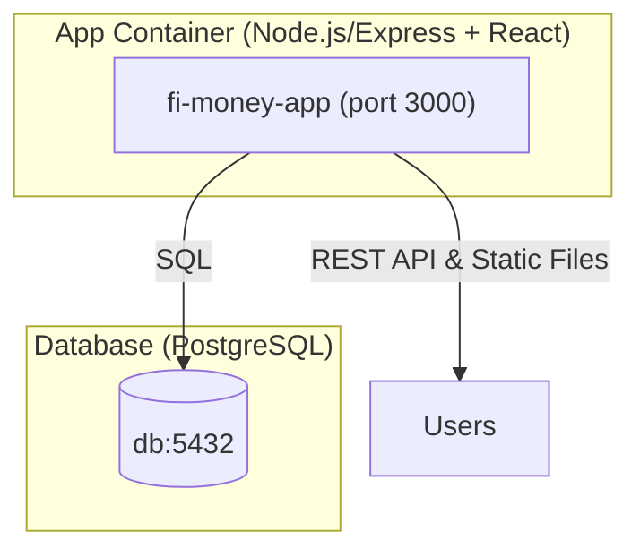

# Inventory Management Tool

A full-stack inventory management application for small businesses. Built with Node.js (Express, PostgreSQL, Sequelize) for the backend and React + Tailwind CSS for the frontend.

---

## Features
- User authentication (signup, login, logout)
- Product management (add, update quantity, list with pagination)
- Inventory analytics (total products, total inventory, most stocked product)
- Secure JWT authentication (HttpOnly cookies)
- Modern, responsive UI
- API documentation (Swagger/OpenAPI)

---

## Project Structure
```
.
├── backend/                  # Backend service (Node.js, Express, PostgreSQL)
│   └── ...
├── frontend/                 # Frontend service (React, Tailwind CSS)
│   └── ...
├── Dockerfile                # Root Dockerfile (builds frontend+backend together)
└── README.md                 # Main project documentation
```

---

## Architecture Overview



- **App Container**: Runs both backend API and serves frontend static files (single container)
- **Database**: PostgreSQL (must be run separately)

---

## Running Both Frontend and Backend Together Using the Root Dockerfile

The root-level `Dockerfile` is designed to build and serve both the frontend (React) and backend (Node.js/Express) in a single container. The backend will serve the API and also serve the frontend static files.

### Steps:

1. **Build the Docker image from the root directory:**
   ```sh
   docker build -t fi-money-app .
   ```
2. **Run the container:**
   ```sh
   docker run -p 3000:3000 --env-file ./backend/.env fi-money-app
   ```
   - The app (API and frontend) will be available at [http://localhost:3000](http://localhost:3000)
   - The backend serves API routes and the frontend static files from the same port.

3. **Database Requirement:**
   - The container does NOT run a database. You must run PostgreSQL separately (e.g., using the official Postgres Docker image or your own instance).
   - Ensure your `.env` in `./backend` points to the correct database host/port.

---

## Summary of Docker Options

- **Frontend + Backend (single container):** Use the root Dockerfile as shown above

- **Database:** Must be run separately (not included in any Dockerfile)

---
# Optional Method
## Backend Setup

1. **Install dependencies:**
   ```sh
   cd backend
   npm install
   ```
2. **Configure environment variables:**
   - Copy `.env.example` to `.env` and fill in your DB and JWT details.
3. **Initialize the database:**
   - Run the SQL in `database-init.sql` on your PostgreSQL instance.
4. **Start the backend:**
   ```sh
   npm run dev
   ```
5. **API docs:**
   - Swagger UI at [http://localhost:3000/api/docs](http://localhost:3000/api/docs)

---

## Frontend Setup

1. **Install dependencies:**
   ```sh
   cd frontend
   npm install
   ```
2. **Configure environment variables:**
   - Copy `.env.example` to `.env` and set `REACT_APP_API_URL` to your backend URL (e.g., `http://localhost:3000`).
3. **Start the frontend:**
   ```sh
   npm start
   ```
   - App runs at [http://localhost:3001](http://localhost:3001) by default.

---

## Environment Variables

### Backend (`backend/.env.example`):
```
DB_HOST=localhost
DB_PORT=5432
DB_USER=your_db_user
DB_PASSWORD=your_db_password
DB_NAME=your_db_name
JWT_SECRET=your_jwt_secret
PORT=3000
FRONTEND_URL=http://localhost:3001
```

### Frontend (`frontend/.env.example`):
```
REACT_APP_API_URL=http://localhost:3000
PORT=3001
```

---

## Database Schema (PostgreSQL)

```
drop type if exists user_role;

create table users (
  id uuid primary key default gen_random_uuid (),
  username varchar(50) unique not null,
  password_hash varchar(255) not null,
  created_at timestamptz not null default now(),
  updated_at timestamptz not null default now()
);

create table products (
  id uuid primary key default gen_random_uuid (),
  name varchar(255) not null,
  sku varchar(100) unique not null,
  type varchar(100),
  description text,
  image_url varchar(2048),
  quantity int not null default 0 check (quantity >= 0),
  price numeric(10, 2) not null,
  created_at timestamptz not null default now(),
  updated_at timestamptz not null default now()
);

create table inventory_updates (
  id uuid primary key default gen_random_uuid (),
  product_id uuid not null references products (id) on delete cascade,
  user_id uuid references users (id) on delete set null,
  old_quantity int not null,
  new_quantity int not null,
  change_description varchar(255),
  created_at timestamptz not null default now()
);

create index idx_inventory_updates_product_id on inventory_updates using btree (product_id);
create index idx_inventory_updates_user_id on inventory_updates using btree (user_id);
```

---

## API Documentation

### Authentication
- **POST /api/auth/signup**
  - Request: `{ "username": "string", "password": "string" }`
  - Response: `201 Created`
    - `{ id: string, message: "User created successfully" }`
    - `409 Conflict`: `{ error: "Username already exists" }`
    - `400 Bad Request`: `{ error: "Username and password are required" }`

- **POST /api/auth/login**
  - Request: `{ "username": "string", "password": "string" }`
  - Response: `200 OK`
    - `{ message: "Login successful" }` (JWT cookie set)
    - `401 Unauthorized`: `{ error: "Invalid credentials" }`
    - `400 Bad Request`: `{ error: "Username and password are required" }`

- **GET /api/auth/me**
  - Response: `200 OK` if authenticated
    - `{ id: string, username: string }`
    - `401 Unauthorized` if not authenticated

### Products
- **POST /api/products** (auth required)
  - Request: `{ name, type, sku, image_url, description, quantity, price }`
  - Response: `201 Created`
    - `{ id: string, message: "Product added successfully" }`
    - `409 Conflict`: `{ error: "SKU already exists" }`
    - `400 Bad Request`: `{ error: "Missing required fields" }`

- **PUT /api/products/:id/quantity** (auth required)
  - Request: `{ quantity: integer }`
  - Response: `200 OK`
    - `{ message: "Quantity updated successfully", product: { ...updatedProduct } }`
    - `404 Not Found`: `{ error: "Product not found" }`
    - `400 Bad Request`: `{ error: "Quantity must be a non-negative integer" }`

- **GET /api/products** (auth required)
  - Query: `?page=1&limit=10`
  - Response: `200 OK`
    - `{ page: number, limit: number, total: number, products: [ ... ] }`

### Health
- **GET /api/health**
  - Response: `200 OK` if healthy
    - `{ status: "ok", db: "connected" }`
  - Response: `500 Internal Server Error` if DB is not connected
    - `{ status: "error", db: "disconnected", error: string }`

---

## .gitignore

### Main project `.gitignore`:
```
node_modules/
.env
.DS_Store
*.log
```

### Backend (`backend/.gitignore`):
```
node_modules/
.env
logs/
*.log
.DS_Store
```

### Frontend (`frontend/.gitignore`):
```
node_modules/
.env
.DS_Store
```

---

## License
MIT 